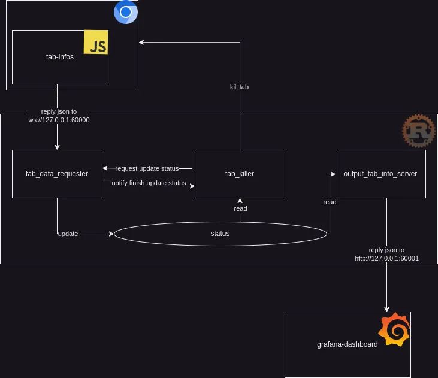
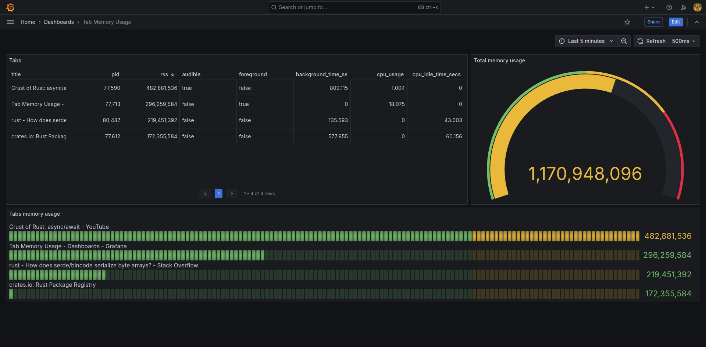

# tab-memory-manager

A memory management strategy more aggressive than Chromium's native memory management mechanism.

Users can configure related options in "~/.config/tab-memory-manager.toml" such as Chromium's maximum memory usage, the idle time threshold for removing tabs, and the memory management strategy to use.

By setting these parameters, users can decide how the program handles memory associated with tabs.



For tab memory management strategies, there are three approaches:

- RSS Limit Strategy

  When the memory usage reaches the given rss_limit, the manager releases memory from tabs (excluding the foreground tab) starting with the ones consuming the most memory, until the total memory usage falls below the rss_limit.

- Idle Time Strategy (🚧 Not implemented)

  Based on the user-defined idle time, the manager evaluates the memory usage changes of each tab.
  
  Tabs that show no significant memory usage variation within the idle_time and are not in the foreground are considered idle and have their resources released.

- Memory Change Rate Strategy (🚧 Not implemented)

  Determine whether the page is an idle page based on the change amount of the paging memory within the specified time, and the idle page will be released.

## Usage

- Install browser extension "tabs-info"

  The extension only work with Chromium **dev channel** (Need permission `processes` which only on dev channel).

  Manage extension > check Developer mode > Load unpacked > Select tabs-info

- Build and run "tab-memory-manager"

  It listen on "127.0.0.1:5000" for tab information, which should be given by browser extension.

  ```shell
  cargo run -r
  ```

## Grafana dashboard (optional)

The project supports a Grafana visualization dashboard.

After installing Grafana, load the grafana/template.json file to view the memory usage of each Chromium tab, as shown in the example below.



- Install grafana

```
sudo pacman -Ss grafana
```

- Import dashboard

- Add data source (json)

  Set url to "127.0.0.1:5000"

- Install grafana plugin

```
sudo grafana cli plugins install marcusolsson-json-datasource
```

- Start grafana

```
sudo systemctl start grafana
```
